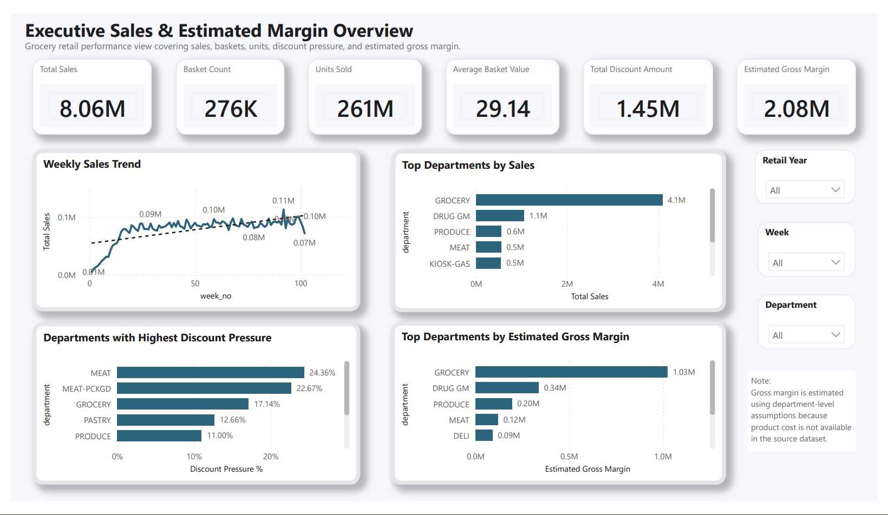
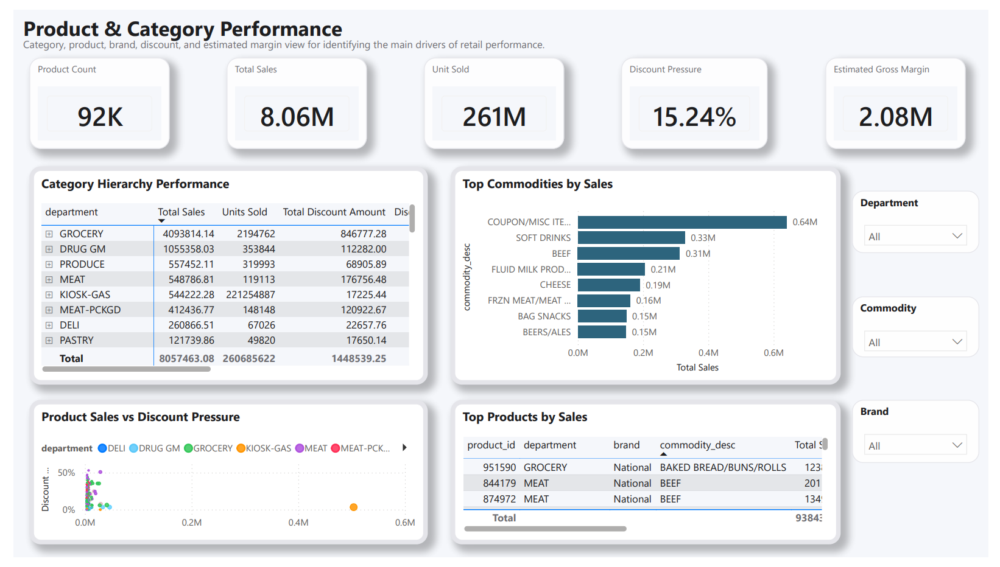
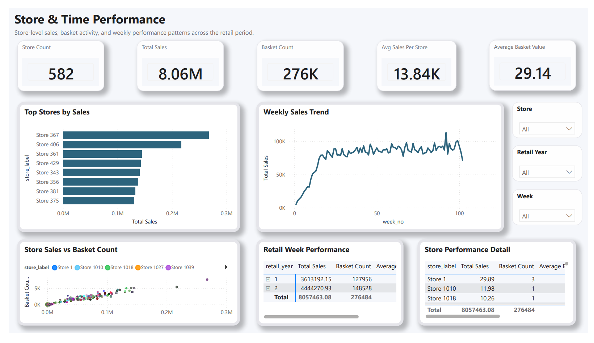
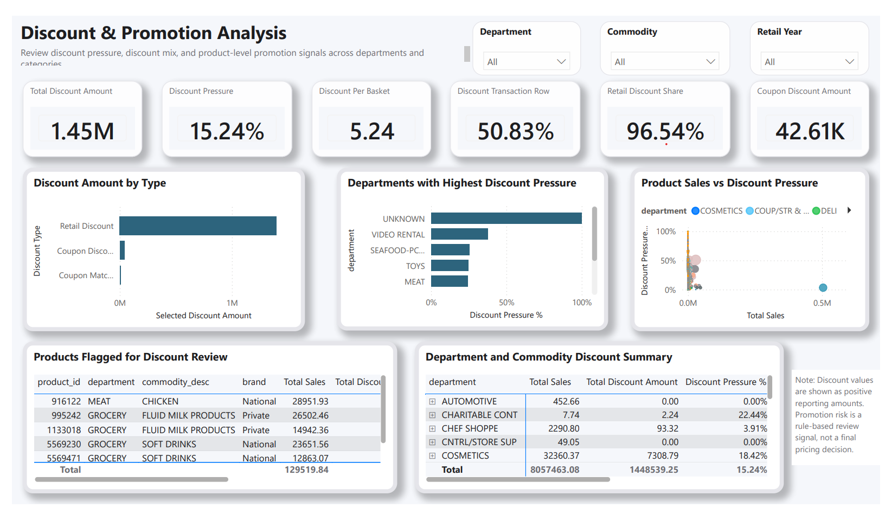
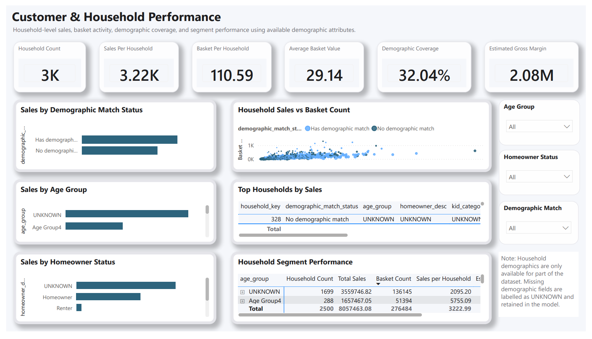
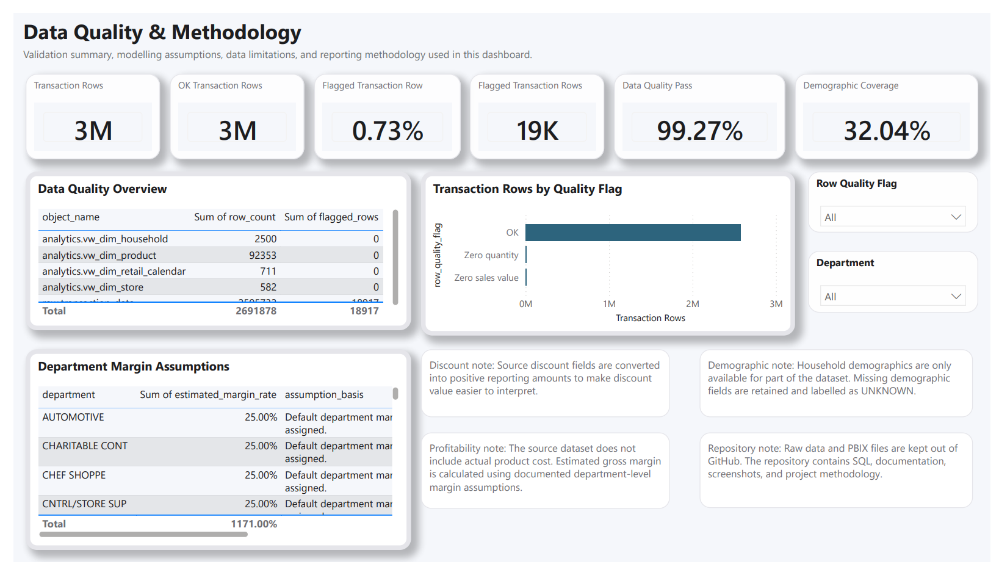

# Executive Sales & Estimated Margin BI Dashboard

I built this project as a practical way to bring PostgreSQL, SQL and Power BI together in one complete retail analysis.

The project starts with raw grocery transaction files and follows the data through loading, validation, SQL modelling and Power BI reporting. The final dashboard looks at sales, baskets, stores, product categories, discounts and household behaviour.

The dataset does not include product cost, so the margin figures in this project are estimates based on documented department-level assumptions. I have kept that limitation visible throughout the dashboard instead of presenting the results as exact profit.

## View the project

Live portfolio:

[View the online project page](https://mindyverse.github.io/executive-sales-profitability-bi-dashboard/)

Detailed case study:

[Read the project case study](docs/portfolio_case_study.md)

## Dashboard preview



The report contains six pages:

1. Executive Overview
2. Product and Category Performance
3. Store and Time Performance
4. Discount and Promotion Analysis
5. Customer and Household Performance
6. Data Quality and Methodology

<details>
<summary>View the remaining dashboard pages</summary>

### Product and Category Performance



### Store and Time Performance



### Discount and Promotion Analysis



### Customer and Household Performance



### Data Quality and Methodology



</details>

## Why I chose this project

I wanted to build something more realistic than a simple spreadsheet dashboard.

The dunnhumby Complete Journey dataset gave me the chance to work with millions of transaction rows and several related areas of a retail business, including products, baskets, stores, discounts and households.

It also gave me a useful modelling challenge. The data contains sales and discount information but no product cost, so I had to think carefully about how to discuss margin without overstating what the data could prove.

## Questions I explored

The dashboard was designed around questions such as:

- Which departments and product categories contribute the most sales?
- Which stores have the strongest sales and basket activity?
- How does performance change across retail weeks?
- Where is discount pressure highest?
- Which products may be worth reviewing because of their sales and discount levels?
- What can be learned from the available household data?
- Which limitations should be understood before using the results?

## Tools I used

| Tool | How I used it |
|---|---|
| PostgreSQL | Stored the raw data and organised the database into raw, reference and analytics schemas |
| SQL | Loaded, checked, cleaned and prepared the data for reporting |
| Power BI | Built the data model, DAX measures and final dashboard pages |
| VS Code | Wrote SQL scripts and project documentation |
| Git and GitHub | Tracked changes and published the project |
| GitHub Pages | Published the online project page |

## Dataset

The project uses the dunnhumby Complete Journey grocery retail dataset.

The main files used were:

- `transaction_data.csv`
- `product.csv`
- `hh_demographic.csv`

The transaction file contains 2,595,732 rows.

Raw data files are kept locally and are not included in this repository. The PBIX working file is also kept local. The repository contains the SQL scripts, documentation, theme file and dashboard screenshots needed to understand the project.

## How I built it

### 1. Prepared the project workspace

I created a clear folder structure for the data, SQL scripts, Power BI files, screenshots, documentation and working notes.

### 2. Loaded the data into PostgreSQL

I created three database schemas:

- `raw`
- `ref`
- `analytics`

The source CSV files were loaded into raw tables before any reporting logic was added.

### 3. Checked the data

Before building the dashboard, I checked:

- source and database row counts
- missing key fields
- zero quantity and zero sales rows
- product joins
- household demographic coverage
- unusual discount values

### 4. Created the analytics layer

I used SQL views to prepare the main fact and dimension tables for Power BI.

The Power BI model includes:

| Table | Purpose |
|---|---|
| `Fact_Sales` | Cleaned transaction-level sales data |
| `Dim_Product` | Product, department, commodity and brand details |
| `Dim_Store` | Store list |
| `Dim_Household` | Household attributes and demographic availability |
| `Dim_Retail_Calendar` | Retail day and week information |
| `Data_Quality_Overview` | Data-quality summary used on the methodology page |
| `Margin_Assumptions` | Department-level assumptions used for estimated margin |

### 5. Built and checked the Power BI model

I created the relationships manually and used single-direction filtering from the dimension tables to the sales fact table.

I also compared the main DAX results against a SQL validation query before using them in the dashboard.

### 6. Designed the report

I wanted the final report to feel calm, polished and easy to explore.

I used a soft background, rounded white cards, blue accents, simple typography and plenty of spacing. The design is intentionally minimal so the data remains the main focus.

## Main measures

Some of the measures used in the report are:

- Total Sales
- Units Sold
- Basket Count
- Average Basket Value
- Total Discount Amount
- Discount Pressure %
- Estimated Gross Margin
- Estimated Margin %
- Sales per Household
- Baskets per Household
- Data Quality Pass %
- Demographic Coverage %

Detailed measure definitions are available here:

[View the measure definitions](docs/measure_definitions.md)

## What stood out in the analysis

A few patterns were especially noticeable:

- Grocery was the largest sales-contributing department.
- Discount pressure differed considerably across departments and products.
- A smaller group of stores contributed strongly to overall performance.
- Some high-sales products also carried higher discount pressure and were marked for review.
- Household demographic information was only available for part of the dataset, so missing groups were kept as `UNKNOWN` rather than being removed.

The discount review flag is only a screening rule. It is not meant to replace a pricing or promotion decision.

## Margin methodology

The dataset does not contain actual cost of goods sold.

To make a directional margin comparison possible, I created a department-level assumptions table and calculated estimated gross margin using those rates.

These figures should be read as estimates for comparison, not as exact accounting profit.

The assumptions and limitations are shown inside the Power BI report and documented in the repository.

## Repository structure

```text
executive-sales-profitability-bi-dashboard/
├── data/
│   ├── raw/                 # Local only
│   └── processed/           # Local only
├── docs/                    # Project documents and case study
├── images/
│   └── dashboard_screenshots/
├── notes/                   # Validation notes and learning log
├── powerbi/                 # Theme file; PBIX remains local
├── sql/                     # Setup, loading, modelling and validation scripts
├── index.html               # GitHub Pages portfolio page
├── .gitignore
└── README.md
```

## Useful files

| File | What it contains |
|---|---|
| `sql/03_create_tables.sql` | Raw and reference table creation |
| `sql/08_prepare_reference_and_indexes.sql` | Indexes and estimated margin assumptions |
| `sql/09_create_analytics_views.sql` | Main analytics views used by Power BI |
| `sql/12_validate_powerbi_kpis.sql` | SQL check for the Power BI measures |
| `docs/portfolio_case_study.md` | Longer project story |
| `docs/methodology.md` | Notes on estimated margin, assumptions and data limitations |
| `docs/data_dictionary.md` | Main fields used in the project |
| `docs/measure_definitions.md` | Power BI measure explanations |

## What I learned

This project helped me understand that a good dashboard depends on much more than the final visuals.

I became more confident with:

- organising a PostgreSQL database
- loading and validating large CSV files
- preparing reporting views in SQL
- building a Power BI star schema
- writing and validating DAX measures
- handling missing or incomplete data
- documenting assumptions clearly
- presenting a technical project in a way that is easy to follow

The most useful lesson was learning to be careful with claims. When the source data could not support exact profit, I used an estimated measure and explained why.

## Current status

The dashboard, SQL workflow, documentation, screenshots and online portfolio page are complete.

LinkedIn sharing has been left for later so I can review and refine the public wording first.

## About me

I am Sanduprabha Rashmindi, a Business Computing and Data Analytics graduate building practical projects in data analytics and business intelligence.

This project was created as part of my portfolio while developing my skills in SQL, PostgreSQL, Power BI and business reporting.